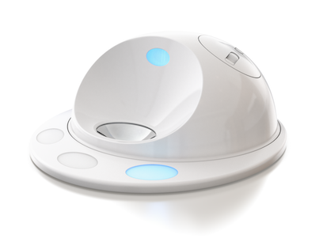

## CleverPet Hub

The [CleverPet Hub](https://clever.pet/) is a programmable device that lets you automatically train and interact with other species. It's kind of like a "game console for pets".

The Hub is built on the [Particle](https://particle.io) platform, which means that the full suite of tools Particle has built can be used to control the CleverPet Hub.

This package shows you how to access the CleverPet Hub's HubInterface class, letting you control the Hub's lights, food pod, and tray motor.

## Quickstart

1. Pick up a [Particle Photon](https://store.particle.io/products/photon)
2. Configure your Photon using Particle's [Tinker app](https://docs.particle.io/tutorials/developer-tools/tinker/core/), then [swap your own Photon for the one that's in your Hub](VIDEO_GOES_HERE). Note: *only* Hubs with serial numbers that start with an 'H' have a Photon in them.
3. Sign in on the [Particle website](https://login.particle.io/login), go to the [Particle build platform](https://build.particle.io) and load up the [CleverPet library](https://build.particle.io/libs/hackerpet/). Click on an example, hit the lightning bolt, and BOOM! you've now got a customized CleverPet Hub!

### Setting up reporting

1. Go to [clvr.pt/reports](http://clvr.pt/reports) and copy the provided spreadsheet. Then click the `share` button on the top right. In the share window enter the email address of the hackerpet report server: **`report-server@hackerpet-235515.iam.gserviceaccount.com`**, and click OK.  
2. Go to the [integrations page](https://console.particle.io/integrations) on the Console of your Particle account. Click on **New integration**. Then pick a **Webhook**. For **Event Name** you fill in `report`.  
For **URL** you fill in the following URL (replace with your sheet ID):  
`https://report.hackerpet.com/v1/report?sheet_id=<YOUR_SPREADSHEET_ID_GOES_HERE>`. Change the **request type** to `POST`. Change the **request format** to `JSON`. Select your hackerpet photon under **Device**.  Click `save`.

### What now?

The fun stuff is all in the examples folder -- if your dog or cat already understands how the lights and touchpads work, and you're immediately interested in a new game for your pup to try, try the WhackAMole game: by playing with the speed that the lights change you can make the game easier or harder! Note that many of the examples won't work unless there's something that looks like a kibble in the silver food tray. Anything dark that's between the size of a MicroSD card and an almond should do the trick.

## Definitions

In the hackerpet library words such as "challenge", "interaction" etc. are used in specific ways:

*  **Player:** Any dog, cat, person, or other animal who is playing with a Hub.

*  **Foodtreat:** A food reward. E.g., a dog treat, cat treat, or piece of kibble.

*  **Report:** A single row of data describing everything that a player did during an interaction.

*  **Interaction:** A presentation of lights, sounds from a Hub, and the corresponding responses of a player, ending with a report. Nearly always, an interaction begins with the Hub doing some things, the player doing some things in response, and then the player getting some feedback as to whether they did the right thing.

*  **Challenge:** A series of one or more interactions, usually of progressively increasing difficulty, and often designed to teach the player a particular skill. *Example: the Responding Quickly challenge where the pet has to go through several iterations of pushing multiple lit up buttons and getting foodtreats.**

*  **Challenge set:** A series of challenges, such as the collection of 13 original CleverPet challenges.

*  **Level:** A stage of difficulty within a given challenge. Lower levels are easier, and each challenge usually has a fixed number of them.

*  **Game:** A fuzzy term, currently without precise technical definition, sometimes used interchangeably with "challenge", but which may consist of multiple challenges.

## What this library can't (yet?) do

Computer-supported training requires recording how well a player is doing and adjusting the game accordingly. This can often take *weeks* or *months*.

To get your player fully trained up with the Hub, start with the standard CleverPet curriculum (the challenges beginning with `0`). If your player is new to CleverPet you should start them off with challenge 000 and only shift them to the next challenge *when you're certain they're ready*. If you shift them up too early *this can significantly increase the time required for training*, since the player will at first learn the "wrong" thing and then need to unlearn it afterward. It's much better to have your player learn a little too slowly than a little too quickly.

Roughly speaking, the learning steps required for getting your player to productively using the Hub are, in order:

1. **Comfortable:** the player shouldn't be running away from the sounds and movements the Hub makes.
2. **Curious:** once they're **comfortable**, it's important that they get **curious** about the Hub.
3. **Touching:** when the player is **curious** they will start exploring the Hub with their nose or paws, and learn that **touching** the touchpads does something.
4. **Seeing:** after a player gets that they can **touch the touchpads**, it's possible to begin to teach them the relationship between the touchpads' **lights** and the player's behavior.

## Important considerations when building games for dogs/cats/pigs etc.

0. **Lit-up buttons are obviously meaningful to us but not to other animals.** It's easy to make the mistake of expecting your player to be able to "see the lights" before they've learned that they they are even a thing. Much of learning is forgetting what was confusing in the first place, and so just because something seems obvious doesn't mean that it is. By default, assume a player will need to be taught anything that they haven't demonstrated they already know.

1. **Animals learn by reinforcement. When they get positive feedback for doing something, they'll do it more.** For example, when a player gets to eat a treat for sitting they'll sit near you more often. The opposite is also true: when they get negative feedback (e.g., running into a glass door) they'll be less likely to do that again in the future. Critically important in *both* cases is an animal's ability to distinguish the good or bad thing that led to the reward: giving your dog or cat their treat a week after they do what you want them to do isn't going to work. Use the Hub to provide a foodtreat when you've noticed your player doing what they should do, and then don't provide a foodtreat when they don't. And when your player is just guessing, you can get them to slow down by delaying the start of a new interaction.

2. **Training something new is a *lot* easier than untraining something.** Once you teach a cat to flush the toilet, it's hard to then teach the cat to only do it when needed. Teach a dog to ring the bell when he wants to "go" and he'll do it just to get some fresh air. If your player has come to the conclusion that just hitting one of the touchpads will let him "win", teaching him to do something different will be hard. When you're doing automatic training, only advance to a new difficulty level when you're pretty sure that the player has nailed the one they're currently on. If you advance too quickly, the player might find themselves learning a "new skill" that you never wanted them to have learned.

3. **Train gradually through [successive
approximation](https://en.wikipedia.org/wiki/Shaping_(psychology)#Successive_approximations).** If you want your player to memorize a sequence of 12 lights, start by teaching her to remember the location of just one. Once she's figured out one light, occasionally intersperse two lights instead of just one. Once the player's performance on two lights improves, go to three lights, and so on.

4. **Whenever possible take advantage of actions an player does "by accident"** This is what scientifically-minded people often call behavioral "noise". By quickly rewarding the times that a behavioral "mistake" is in the right direction (e.g., when teaching "lie down" and a dog "accidentally" lies down) you can accelerate training significantly. If you want your player to touch a touchpad, it can be helpful to allow an interaction to continue even if a player has touched the "wrong" touchpads as may give them a chance to touch the right one.

## Kinds of feedback you can give your player

In training, you have the option of giving positive feedback, negative feedback, or giving no feedback. In the world of behavioral conditioning, positive feedback is referred to as a "positive reinforcer", and negative feedback is referred to as a "negative reinforcer". Positive reinforcers have the effect of causing a behavior to *more*, while negative reinforcers have the effect of causing a behavior to happen *less*.

*Primary* reinforcers (whether positive or negative) are kinds that are "built in", that a player doesn't need to learn. In dog training, e.g., the most common positive primary reinforcer is a dog treat. A cactus, on the other hand, surrounds itself with spines that can sometimes become primary *negative* reinforcers to a too-inquisitive dog.

It's helpful to know that a primary *positive* reinforcer can be either *adding* something a player *likes*, or *removing* something the player *doesn't like*. For example, because dogs don't like the feeling of needing to pee, when they finally get to do so this negative feeling is removed. Their getting to pee, then, is a primary reinforcer.

By the same token, a primary *negative* reinforcer can be *adding* something a player *doesn't like*, or *removing* something the player *likes*. E.g., since puppies usually like play and attention, abruptly stopping play (e.g., when the puppy bites you) is a primary negative reinforcer. You might use this to discourage biting.

*Secondary* reinforcers are anything the dog has *learned* to associate with a particular primary reinforcer. In clicker training dogs, e.g., the trainer makes a "click-click" sound at the same time as providing a primary reinforcer (usually a dog treat). Over time, the dog learns to associate the clicker sound with the dog treat. The trainer will usually increase the time between the clicker sound and providing the treat. This can increase the strength of the clicker and even allow it to be used without the primary reinforcer.

In training, a secondary *negative* reinforcer is often a sound that's associated with the player not getting what they'd like to get. E.g., most dogs quickly learn what "no" means, even though "no" on its own (probably) isn't something that would otherwise be negative to a dog.

It's worth mentioning that the primary/secondary distinction is not a pure one. Sounds themselves have intrinsic qualities which can be pleasant or unpleasant. So the relationship a sound has to the feelings it brings about is not entirely arbitrary (for example check out the [bouba/kiki effect](https://en.wikipedia.org/wiki/Bouba/kiki_effect)). Another example is when people say things in a lower-pitched growl ("don't do that!") when expressing their displeasure, something that seems to be quickly understood by humans and dogs alike.

## Contributing

This is where things can get really fun. Want to add a new game, and perhaps see how the community, or dogs, or cats, respond to it? Create your own fork and submit a pull request. We'll chat about it as a community, and if it seems sensible we'll add it to the collection of games!

To make this work, all contributors first have to sign the [CleverPet Individual Contributor License Agreement (CLA)](https://docs.google.com/forms/d/e/1FAIpQLSeXAajtFZpQ0VtHK2APtfzrA5w8DMNagJhCfLVr6h9lCQgj1g/viewform), which is based on the Google CLA. This agreement provides the CleverPet team with a license to re-distribute your contributions. After you sign, we'll add you to the group that enables you to submit pull requests, etc.

Whenever possible, please follow these contribution guidelines:
- Keep each pull request small and focused on a single game, feature, or bug fix.
- Familiarize yourself with the code base, and follow the formatting principles adhered to in the surrounding code.

[hub]: https://github.com/CleverPet/HackerPet/blob/master/docs/images/hub1.png "Hackerpet hub"
